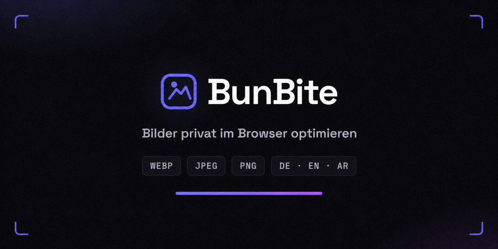
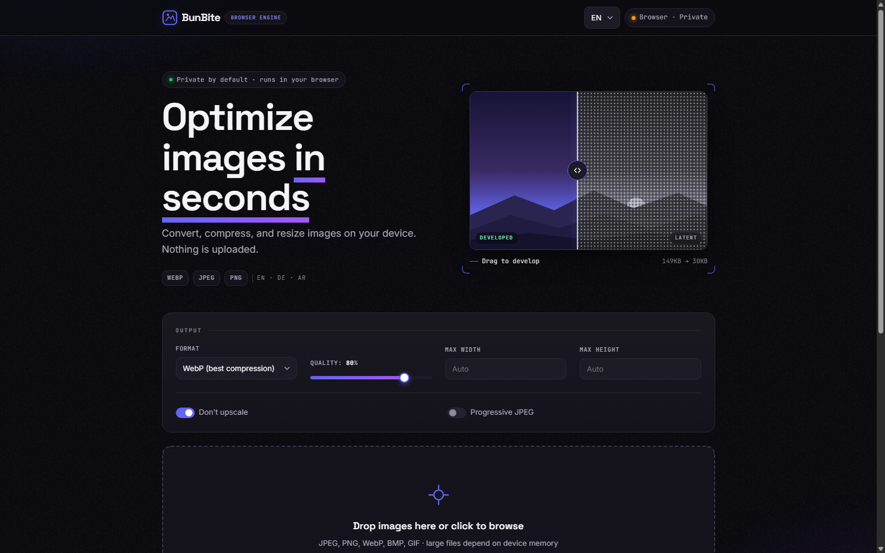
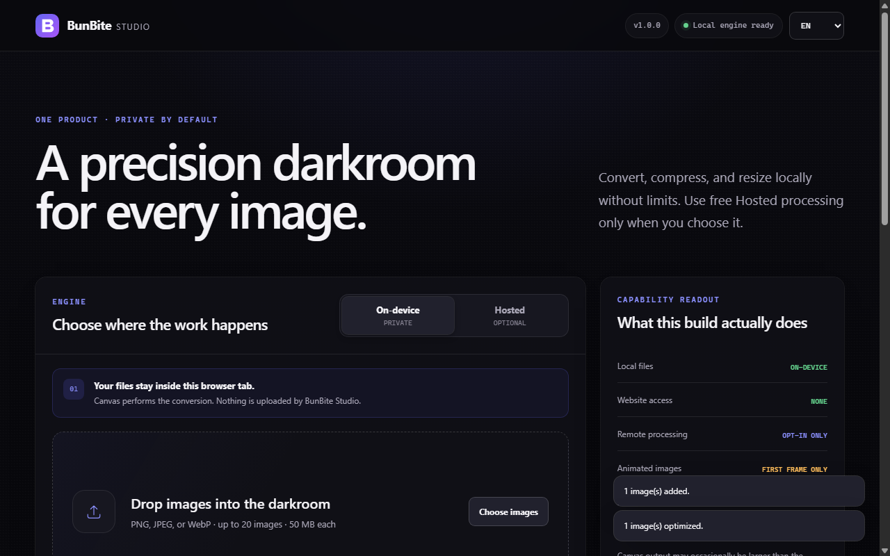

# BunBite



BunBite ist eine quelloffene Bildoptimierung für WebP, JPEG und PNG. Bilder lassen sich direkt im Browser konvertieren, komprimieren und verkleinern. Die lokale Verarbeitung lädt keine Bilddaten hoch; optional steht eine kostenlose Hosted-Verarbeitung unter Fair-Use-Grenzen bereit.

Die Weboberfläche und die separat vertriebene Chromium-Browser-Erweiterung unterstützen Deutsch, Englisch und Arabisch einschließlich Rechts-nach-links-Darstellung.



## Funktionen

- Lokale Bildverarbeitung mit Canvas, ohne Upload an BunBite
- WebP-, JPEG- und PNG-Ausgabe mit Qualitäts- und Größensteuerung
- Stapelverarbeitung, maximale Breite und Höhe sowie Schutz vor Hochskalierung
- Ehrliche Größenbilanz: auch größer gewordene Ergebnisse werden als solche angezeigt
- Optionaler Hosted-Modus mit Bun, gemeinsamer Kapazität und Fair-Use-Tagesquote
- Deutsche, englische und arabische Oberfläche
- Minimale First-Party-Analytics auf der Website; `Do Not Track` wird respektiert
- Keine Analytics in der Browser-Erweiterung

BunBite ist ein einziges kostenloses Produkt. Die lokale Verarbeitung hat keine Kontingent- oder Kontopflicht. Die Hosted-Verarbeitung erlaubt derzeit 50 erfolgreiche Konvertierungen pro UTC-Tag, höchstens 20 MiB pro Datei und Stapel mit bis zu 10 Bildern.

## Unterstützte Formate

Die Weboberfläche erzeugt WebP, JPEG oder PNG. Browser können zusätzlich BMP- und GIF-Dateien einlesen; animierte Inhalte werden dabei nicht als Animation erhalten. Die separate Chromium-Erweiterung akzeptiert PNG, JPEG und WebP und gibt dieselben drei Formate aus.

AVIF-Ausgabe ist derzeit nicht implementiert. BunBite behauptet deshalb keine AVIF-Konvertierung.

## Lokal starten

Voraussetzungen: Bun 1.3.14 sowie Node.js 20 oder neuer für die Repository-Prüfungen.

Weboberfläche und API:

```sh
cd server
bun install --frozen-lockfile
cd ..
bun run server/server.ts
```

Danach `http://localhost:3000` öffnen.

Nur die private Browser-Engine, ohne Hosted-API:

```sh
npx serve public
```

## Browser-Erweiterung



Die Chromium-Erweiterung wird als getrenntes Distributionsartefakt gepflegt. Sie verarbeitet Bilder standardmäßig lokal und fordert Hosted-Zugriff nur für den festgelegten BunBite-Ursprung an. Quellcode, Store-Eintrag und Installationshinweise gehören in das separate Erweiterungs-Repository. Dieses Web-Repository behauptet weder einen veröffentlichten Store-Eintrag noch eine signierte Erweiterungsveröffentlichung.

## Datenschutzmodell

- Lokal: Bilddaten bleiben im Browser-Tab.
- Hosted: Das gewählte Bild wird verarbeitet, zurückgegeben und nicht in den persistenten Anwendungsspeicher geschrieben.
- Tagesquote: Der Server bildet aus der Netzwerkadresse und einem geheimen Schlüssel eine pseudonymisierte keyed-HMAC-Kennung. Beim Serverstart sowie vor jedem Lesen oder Schreiben werden alle Quotenzeilen gelöscht, deren Tag nicht dem aktuellen UTC-Kalendertag entspricht.
- Analytics: Gespeichert werden ausschließlich tägliche Summen erlaubter Ereignisnamen. Es gibt keine Unique-Visitor-Messung, keine Datei- oder Bildmetadaten und keine Browser-Fingerprints.
- DNT: Bei `Do Not Track: 1` sendet der Webclient keine Analytics-Ereignisse.

Details stehen in der [Datenschutzerklärung](public/privacy.html).

## Prüfungen

```sh
node --check public/i18n.js
node --check public/app.js
node scripts/i18n-check.mjs .
node --experimental-websocket scripts/public-browser-smoke.mjs
bun server/test/core.ts
bun server/test/e2e.ts
```

Der Browser-Smoke-Test benötigt Chromium oder Chrome. Falls der Browser nicht an einem Standardpfad liegt, kann sein Pfad über `BUNBITE_CHROME` gesetzt werden.

Vor einer Bereitstellung gelten [DEPLOY.md](DEPLOY.md) und das [Deployment-Runbook](docs/DEPLOYMENT_RUNBOOK.md). Deployment, kanonische Domain, signierte Erweiterungsveröffentlichung und ein frischer, quellgebundener Compliance-Nachweis stehen weiterhin aus. Die private Release-Toolchain und historische Evidenz gehören nicht zum öffentlichen Web-Snapshot.

## Architektur

Der Webclient prüft `/api/health`. Ist die API erreichbar, verarbeitet `/api/optimize` die Bilder; andernfalls arbeitet Canvas lokal. Eine abgelehnte Hosted-Anfrage erzeugt kein Upselling und blockiert die lokale Nutzung nicht.

Der Server verwendet Buns Bild-API und SQLite für die aktuelle Tagesquote sowie aggregierte Ereigniszähler. Kapazitätsgrenzen und der Skalierungspfad sind in [SCALING.md](SCALING.md) beschrieben.

## Über den Autor

Entwickelt in Berlin von Ahmad Othman Ammar Adi, einem syrischstämmigen Softwareentwickler. Weitere Angaben stehen in [AUTHORS.md](AUTHORS.md).

## English summary

BunBite is an open-source image optimizer for WebP, JPEG, and PNG. It processes images locally by default, offers optional no-charge hosted processing under fair-use limits, supports German, English, and Arabic, and does not currently provide AVIF output. The Chromium extension is distributed separately.

## Mitwirken und Lizenz

Änderungen sollten eng begrenzt sein und die kleinsten relevanten Prüfungen ausführen. Lokale Datenbanken, Zugangsdaten und erzeugte Pakete gehören nicht in Commits. Fehlerberichte und Pull Requests sind im [GitHub-Repository](https://github.com/OthmanAdi/bunbite) willkommen.

BunBite steht unter der [Mozilla Public License 2.0](LICENSE). Copyright (c) 2026 Ahmad Othman Ammar Adi. Öffentliche Release-Artefakte benötigen zusätzlich aktuelle Drittanbieterhinweise, SBOM, Prüfsummen und die jeweils vorgeschriebenen Signaturen.
